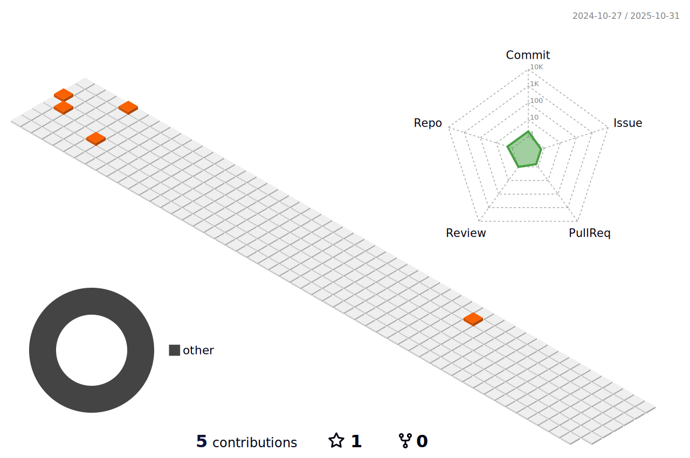

 

# Hi there, my name is Dmitry! I'm Javascript developer. #
I am front-end developer with 1.5 year experience. 
Previously, I worked as a freelancer, and worked on the development of sites in HTML5 + SCSS + JS. 
This knowledge is the foundation in understanding the "BEM methodology", HTML structure and CSS properties, usability and adaptability of the site. 
I am currently actively expanding my knowledge for React development and looking for a position as a react.js developer in a company that will become a second home, where I can quickly grow and develop web development skills every day.
## My skills: ##
 
 
 
 
 
 
 
 
 
 
 
 
 
 
 
 
 
 
 
 

## [My CV](https://dstrizhakov.github.io/rsschool-cv/) ##

## Examples: ## 

## Stay in touch: ##

 

## Statistics: ##

